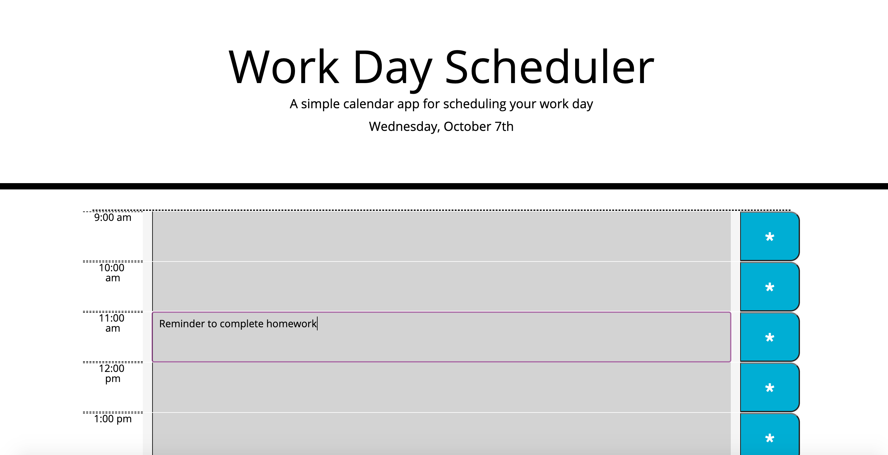
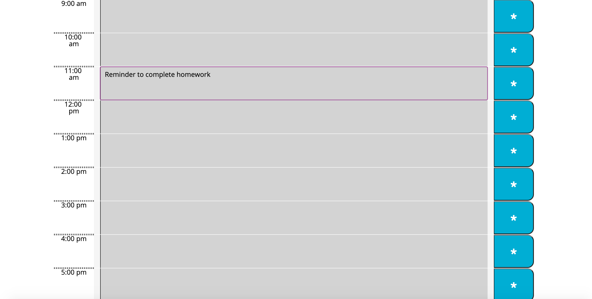

# everyday-scheduler

This weeks assignment had us create a daily schedule where we could add reminders that would be saved to the local storage. The purpose of this assignment was to use JQuery and dynamically create the scheduler. What really helped me through this assignment was using previous class activities and the completed CSS style sheet which included all the ID’s that I used to target in JS. 

# Installation

* Created a git repository
* Created and HTMl and JavaScript file using the CSS given
* What I used to create my page:

* Document Object Model (DOM)
* Functions
* Console logging
* Local Storage
* Event listeners
* For Loops
* Set Attributes
* Moments.js for the time

https://lain7891.github.io/everyday-scheduler/

The biggest hurdle for me was getting the local storage to work properly and save the reminders when added. I definitely utilized the help of my TA’s, tutors and classmates to put this together, even if it is not quite done.

#License

Used MIT License for this assignment. 

